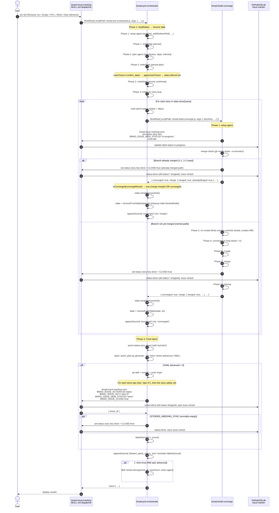
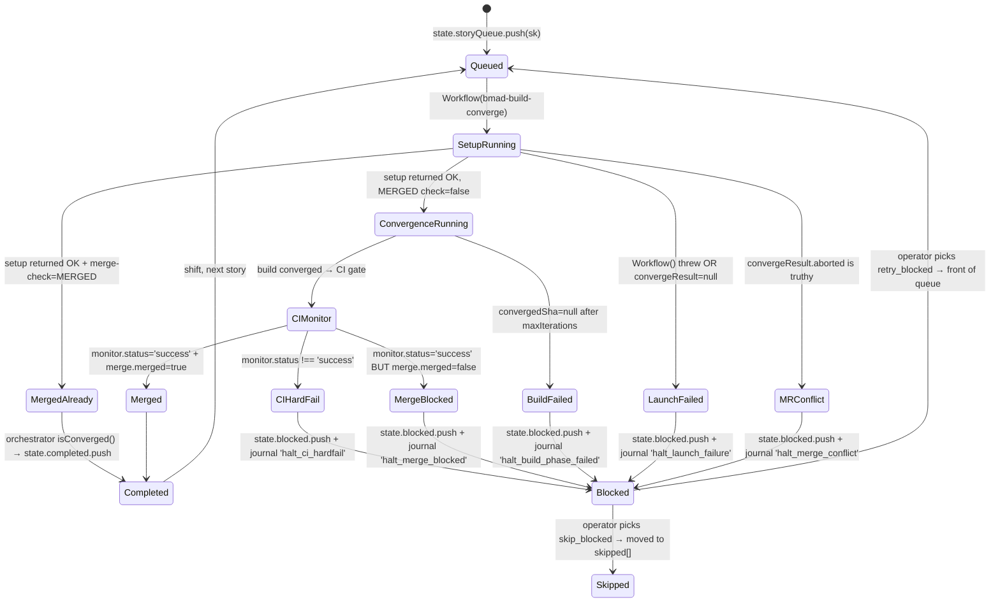
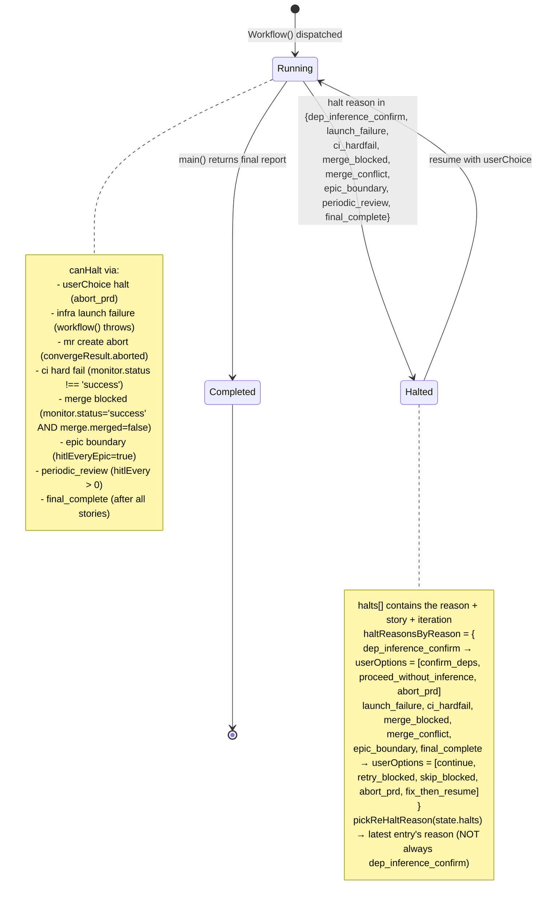
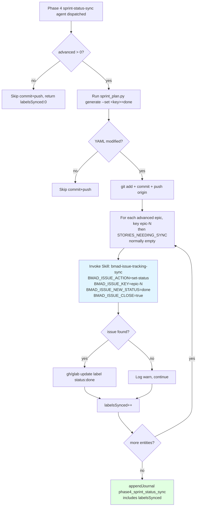

# Orchestrator flow — reference diagrams

> **Important context** : these diagrams document the **JS orchestrator**
> (`skills/bmad-prd-orchestrate/scripts/bmad-prd-orchestrate.js` +
> `skills/bmad-build-converge/scripts/bmad-build-converge.js`). They describe
> the live-test harness used to run bmad-orchestration workflows. They
> are **NOT** documentation of `bmad-loop`'s behavior. bmad-loop is a
> separate Python-based orchestrator with a different architecture
> (flat state machine, no sub-workflow, no remote push, no issue label
> sync). See the "bmad-loop comparison" callouts in each diagram for
> the key differences.

These diagrams capture the **expected behavior** at every step. Use them when
debugging or refactoring — any drift between the diagrams and the code is a
bug. All diagrams are Mermaid (GitHub-renderable, no extra tooling).

## 1. End-to-end sequence — "already merged" scenario

The scenario that motivated most of the recent fixes (1-1, 1-2 merged
externally; orchestrator must pick that up correctly).



### Key invariants

1. **Workflow() is lowercase** (`workflow({...})`) — capital `Workflow` is the
   main-conversation tool, throws `ReferenceError` from sub-workflow context.
2. **`isConverged()` accepts EITHER** `converged:true` OR `merge.merged:true`.
3. **build-converge merge-check uses `git merge-base --is-ancestor`**, then
   case-insensitive check on stdout (`MERGED` / `merged`).
4. **Each story's spec file lives in `_bmad-output/implementation-artifacts/stories/<key>.md`**.
5. **Story issue lifecycle is owned by `bmad-build-converge`.** The setup agent
   sets `in-progress`; the merge agent (and the already-merged short-circuit)
   sets `done` + closes the issue. Standalone convergence therefore leaves the
   tracker consistent without any orchestrator. Both syncs are soft-fail — a
   missing issue never blocks setup or merge.
6. **Epic issue lifecycle is owned by the orchestrator** — only it observes epic
   boundaries (`extractEpicKey` vs `lastEpic`). It sets `in-progress` at the
   boundary and `done` + close in Phase 4, once every story of the epic is done.
   Phase 4 never re-syncs story issues (converge is the sole story-done writer).
   Label sync is soft-fail per entity — the PRD never halts on it.

### bmad-loop comparison

bmad-loop uses a fundamentally different architecture (flat state machine,
not a sub-workflow):
- No `Workflow()` sub-workflow dispatch — bmad-loop invokes `bmad-build-auto`
  Skill directly per story.
- No `state.halts[]` array — uses single `paused_reason: str | None` field.
- Resume does NOT re-pause (single-pause-state semantics).
- No `git push origin` — bmad-loop merges per-story commits locally back to
  the target branch (never touches the remote).
- No issue label sync — bmad-issue-tracking's CLAUDE.md explicitly states
  bmad-loop bypasses the manual branch/MR flow.
- No `phase4_sprint_status_sync` event — bmad-loop terminates with
  `journal.append("run-complete")`.
- No `ESCALATED`, `AWAITING_OPERATOR`, `DEFERRED` etc. as separate states.
- Phase enum differs entirely (`PENDING`, `DEV_RUNNING`, `DEV_VERIFY`,
  `REVIEW_RUNNING`, `REVIEW_VERIFY`, `COMMITTING`, `DONE`, etc.).

See `bmad-loop/src/bmad_loop/model.py` for the actual reference phase enum
and pause state fields.

## 2. Per-story lifecycle (orchestrator's per-story loop)



### Key invariants

- **Completed** is reached only via `isConverged(convergeResult) === true`,
  which means EITHER `converged === true` OR `merge.merged === true`.
- **Blocked** is reached only via one of: launch_failure, ci_hardfail,
  merge_blocked, merge_conflict, or build_phase_failed. Each pushes to
  `state.blocked` AND `state.halts` (with matching `reason`) AND journals
  `halt_<reason>`.
- **Skipped** is reached only via `userChoice='skip_blocked'` → moves blocked
  stories to `state.skipped[]` (not deleted).
- **removeFromState(state, sk)** is called every time a story enters
  `state.completed` — cleans stale entries from a previous failed attempt.

## 3. Halt / resume cycle



### Key invariants

- **Re-halt picks the LATEST halt** (not always `dep_inference_confirm`).
  Bug we fixed: previous code always re-halted `dep_inference_confirm`,
  leaving operators no way to use `skip_blocked` after a `launch_failure`.
- **`userChoice` handler** (in `applyUserChoice`) transforms the
  `planResult.inferred` graph without touching other fields.
- **`skip_blocked`** moves all blocked stories to `skipped[]` and clears
  `blocked[]` + drops matching halt entries (state hygiene).
- **`moveBlockedToSkipped`** is the pure helper for the `skip_blocked`
  mutation.

## 4. Phase 4 sync — sprint-status vs issue labels



### Key invariants

- **Both** the YAML file AND the issue labels must advance. YAML without
  label-sync = drift between source-of-truth and UI. For epics this happens here;
  for stories it already happened at converge merge.
- **Epics here, stories only as a safety net** — `labelsSynced` counts advanced
  **epics** plus the `STORIES_NEEDING_SYNC` entries (stories whose converge-side
  sync soft-failed, or already `done` before the run). That list is empty on the
  happy path: story issues are synced by `bmad-build-converge` at merge.
- **Soft-fail per entity** — one missing issue doesn't block the rest.
  `labelsSynced` counts only entities where the Skill returned a non-null
  `issue_id`.
- **`allowedTools: ['Skill', 'Bash']`** passed by the orchestrator — runtime
  enforces the constraint (the prompt is a hint, not enforcement).
- **try/catch around the sync call** — if the Skill global is unavailable
  (ReferenceError) or the call fails, the orchestrator catches and continues
  with safe defaults (`labelsSynced: 0`). The PRD never halts on label-sync.

## 5. Issue lifecycle — tracker labels per entity

Vocabulary is owned by the upstream `bmad-issue-tracking` module
(`common/ensure-labels.yaml`):

- **Type labels**: `type:prd`, `type:epic`, `type:story`, `type:retrospective`
- **Status labels**: `backlog`, `ready-for-dev`, `in-progress`, `review`,
  `awaiting-operator`, `done` — rendered as `status:<x>` on GitHub and
  `status::<x>` on GitLab (the separator is platform-specific; see
  `ensure-labels.yaml` `{sep}` and `update-issue-status.yaml`).

There is **no `status:close`**. "Closed" is the **issue state**, set by
`close=true` on the atomic. `common/update-issue-status.yaml` drops every
existing `status:*` label before adding the new one, so statuses never stack.

### Generic status machine

```mermaid
stateDiagram-v2
    direction LR
    [*] --> backlog : create-issue
    backlog --> ready-for-dev : spec committed
    ready-for-dev --> in-progress : work starts
    in-progress --> review : dev finished
    review --> in-progress : review verdict != done
    in-progress --> awaiting-operator : human action required
    awaiting-operator --> in-progress : operator unblocks
    in-progress --> done : merged / finished
    review --> done : review verdict = done
    done --> [*] : issue closed (close=true)
```

### Who owns each transition

| Entity | → `in-progress` | → `review` | → `done` + close |
|---|---|---|---|
| **PRD** (`type:prd`) | upstream `bmad-issue-tracking` | upstream | upstream |
| **Epic** (`type:epic`) | **orchestrator** at epic boundary (`epic-status-${currentEpic}`, key `epic-N`) | — | **orchestrator Phase 4**, once every story of the epic is `done` |
| **Story** (`type:story`) | **converge setup** (step 8) | upstream dev-finish — *not used by the JS orchestration* | **converge merge** (also the already-merged short-circuit), `CLOSE=true` |
| **Retro** (`type:retrospective`) | upstream `bmad-retrospective` | — | upstream `bmad-retrospective` |

### Key invariants

- **One writer per transition.** A component only writes a transition it can
  observe: converge observes a single story (setup → in-progress, merge → done),
  the orchestrator observes epic boundaries and cross-story aggregation (epic
  in-progress, epic done). PRD/retro belong to the upstream module.
- **Standalone correctness is the tiebreaker.** Converge owns the story done
  label precisely so a standalone (non-orchestrator) run leaves the tracker
  consistent — the orchestrator is not present to do it.
- **Every tracker sync is soft-fail.** A missing issue or Skill error logs a
  warning and continues; it never blocks setup, merge, or Phase 4.
- **The orchestrator is the sole writer of the `sprint-status.yaml` done
  transition on the PRD branch**, but it never writes the story issue done
  label on the happy path. YAML ownership and label ownership are deliberately
  split.
- **Epic issues are addressed by their canonical sprint key `epic-<N>`, never by
  the bare number.** `find-issue` does a substring search scoped only by the PRD
  label and takes the first hit, so `search_text="2"` matches story issues and
  would close the wrong issue. The epic issue body carries `Sprint Key: epic-N`.
- **Phase 4 carries a story safety net (`STORIES_NEEDING_SYNC`)** covering
  stories whose converge-side sync soft-failed and stories already `done` before
  the run (never dispatched). The list is empty on the happy path, so converge
  remains the primary — and normally the only — writer of the story done label.
