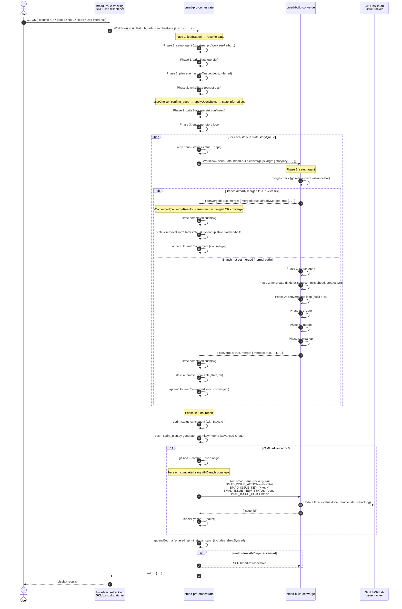
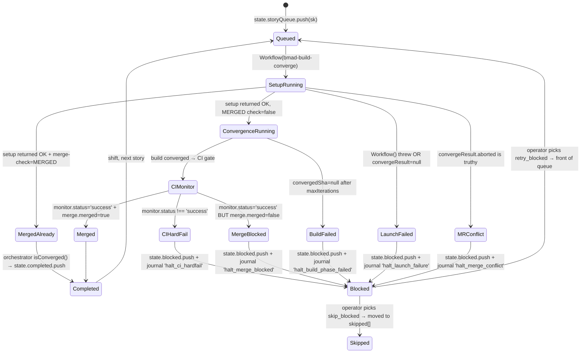
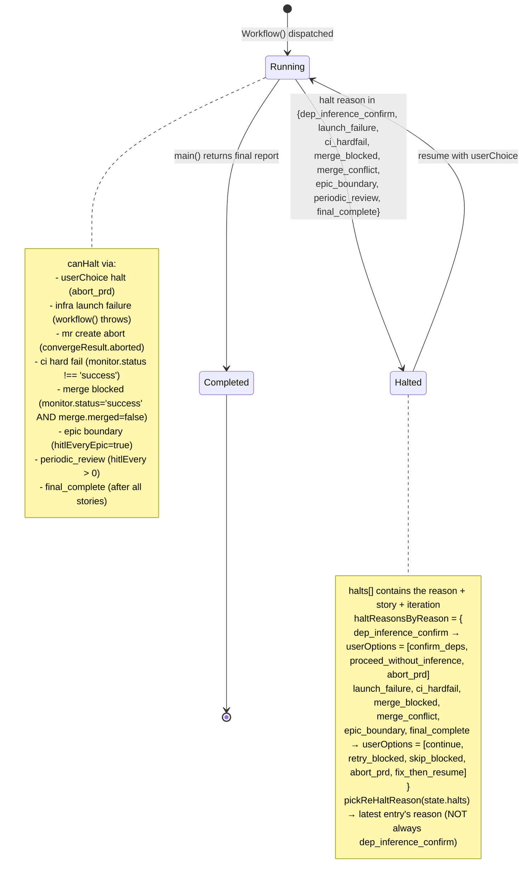
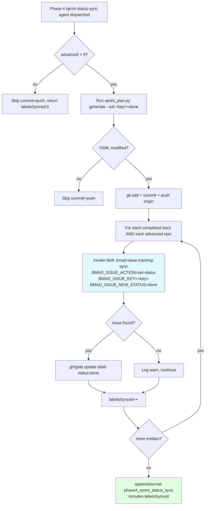

# Orchestrator flow — reference diagrams

These diagrams capture the **expected behavior** at every step. Use them when
debugging or refactoring — any drift between the diagrams and the code is a
bug. All diagrams are Mermaid (GitHub-renderable, no extra tooling).

## 1. End-to-end sequence — "already merged" scenario

The scenario that motivated most of the recent fixes (1-1, 1-2 merged
externally; orchestrator must pick that up correctly).

### Key invariants

1. **Workflow() is lowercase** (`workflow({...})`) — capital `Workflow` is the
   main-conversation tool, throws `ReferenceError` from sub-workflow context.
2. **`isConverged()` accepts EITHER** `converged:true` OR `merge.merged:true`.
3. **build-converge merge-check uses `git merge-base --is-ancestor`**, then
   case-insensitive check on stdout (`MERGED` / `merged`).
4. **Each story's spec file lives in `_bmad-output/implementation-artifacts/stories/<key>.md`**.
5. **Phase 4 labels sync is REQUIRED**, not optional — without it, completed
   stories stay labeled `status:backlog` while YAML says `done` (the bug we
   fixed).

## 2. Per-story lifecycle (orchestrator's per-story loop)

### Key invariants

- **Completed** is reached only via `isConverged(convergeResult) === true`,
  which means EITHER `converged === true` OR `merge.merged === true`.
- **Blocked** is reached only via one of: launch_failure, ci_hardfail,
  merge_blocked, merge_conflict, or build_phase_failed. Each pushes to
  `state.blocked` AND `state.halts` (with matching `reason`) AND journals
  `halt_<reason>`.
- **Skipped** is reached only via `userChoice='skip_blocked'` → moves blocked
  stories to `state.skipped[]` (not deleted).
- **removeFromState(state, sk)** is called every time a story enters
  `state.completed` — cleans stale entries from a previous failed attempt.

## 3. Halt / resume cycle

### Key invariants

- **Re-halt picks the LATEST halt** (not always `dep_inference_confirm`).
  Bug we fixed: previous code always re-halted `dep_inference_confirm`,
  leaving operators no way to use `skip_blocked` after a `launch_failure`.
- **`userChoice` handler** (in `applyUserChoice`) transforms the
  `planResult.inferred` graph without touching other fields.
- **`skip_blocked`** moves all blocked stories to `skipped[]` and clears
  `blocked[]` + drops matching halt entries (state hygiene).
- **`moveBlockedToSkipped`** is the pure helper for the `skip_blocked`
  mutation.

## 4. Phase 4 sync — sprint-status vs issue labels

### Key invariants

- **Both** the YAML file AND the issue labels must advance. YAML without
  label-sync = drift between source-of-truth and UI.
- **Soft-fail per entity** — one missing issue doesn't block the rest.
  `labelsSynced` counts only entities where the Skill returned a non-null
  `issue_id`.
- **`allowedTools: ['Skill', 'Bash']`** passed by the orchestrator — runtime
  enforces the constraint (the prompt is a hint, not enforcement).
- **try/catch around the sync call** — if the Skill global is unavailable
  (ReferenceError) or the call fails, the orchestrator catches and continues
  with safe defaults (`labelsSynced: 0`). The PRD never halts on label-sync.
